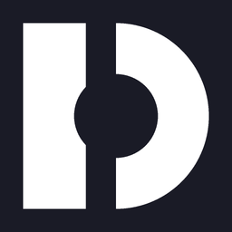
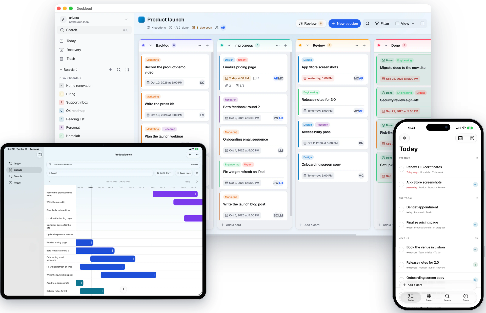
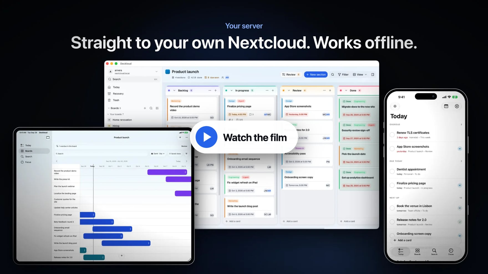
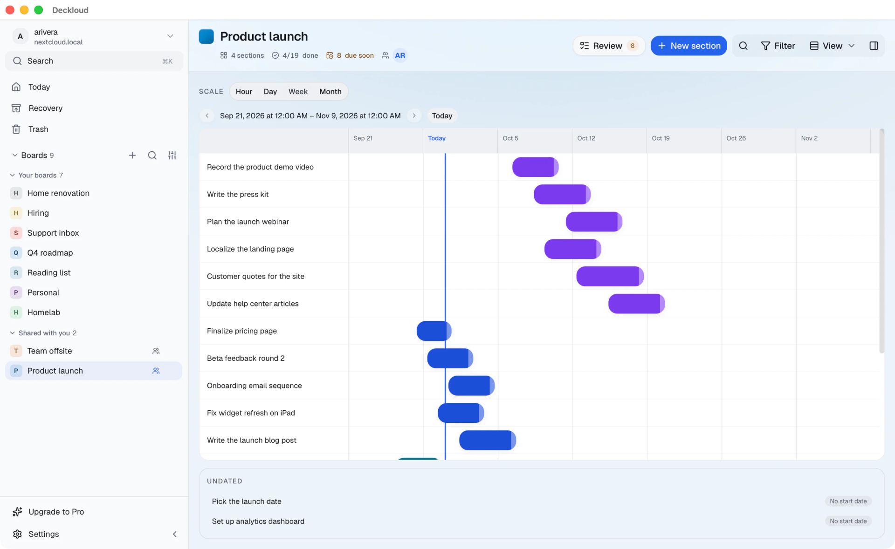
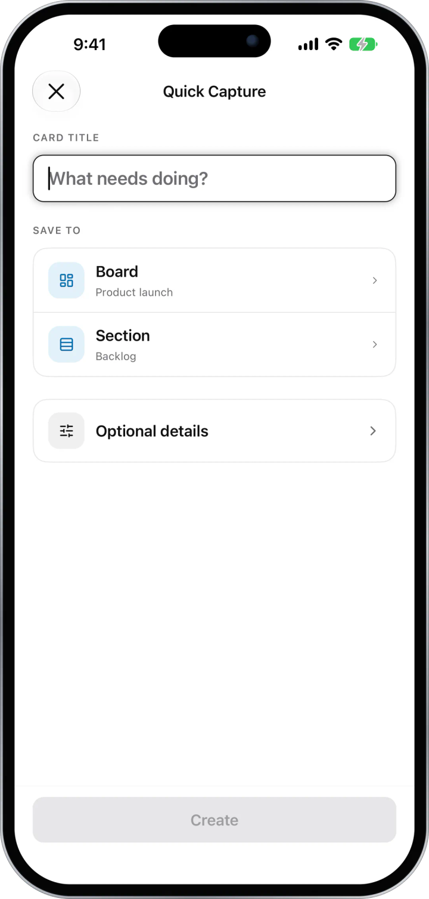
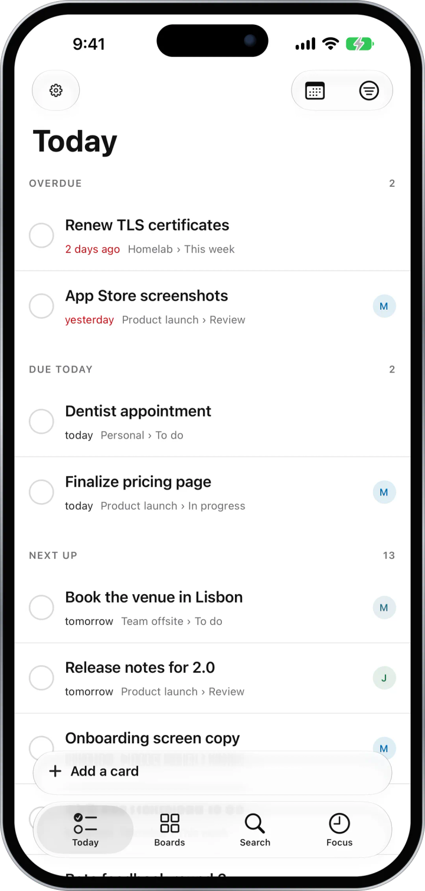
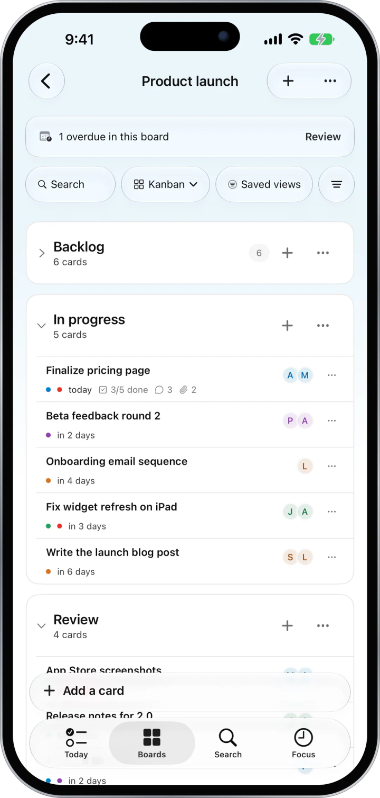
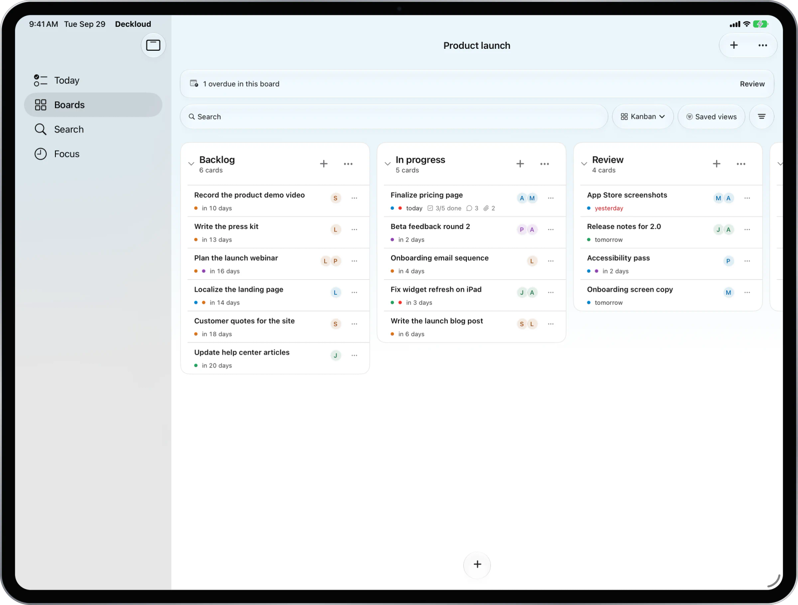

<p align="center">
  
</p>

<h1 align="center">Deckloud</h1>

<p align="center">
  <strong>Your Nextcloud Deck boards on iPhone, iPad, Mac, Windows, and Linux.</strong><br>
  Open the boards you already have, keep working offline, and sync straight to your own Nextcloud server.
</p>

<p align="center">
  <a href="https://github.com/hweihwang/nextcloud-deck-desktop-releases/releases/latest"></a>
  <a href="https://apps.apple.com/app/deckloud/id6756962555?pt=128286558&amp;ct=github-readme&amp;mt=8"></a>
  
  
</p>

<p align="center">
  <a href="https://apps.apple.com/app/deckloud/id6756962555?pt=128286558&amp;ct=github-readme&amp;mt=8"></a>
</p>

<p align="center">
  <strong>Desktop:</strong>
  <a href="https://github.com/hweihwang/nextcloud-deck-desktop-releases/releases/latest/download/stable-macos-arm64-Deckloud.dmg">Mac</a> ·
  <a href="https://github.com/hweihwang/nextcloud-deck-desktop-releases/releases/latest/download/win-x64-Deckloud-Setup.zip">Windows</a> ·
  <a href="https://github.com/hweihwang/nextcloud-deck-desktop-releases/releases/latest/download/linux-x64-Deckloud-Setup.tar.gz">Linux x64</a> ·
  <a href="https://github.com/hweihwang/nextcloud-deck-desktop-releases/releases/latest/download/linux-arm64-Deckloud-Setup.tar.gz">Linux arm64</a> ·
  <a href="#download">All downloads and requirements</a>
</p>

<p align="center">
  <picture>
    <source media="(prefers-color-scheme: dark)" srcset=".github/assets/hero-dark.png">
    
  </picture>
</p>

<p align="center">
  <a href="#what-deckloud-does">About</a> ·
  <a href="#features">Features</a> ·
  <a href="#privacy">Privacy</a> ·
  <a href="#updating">Updating</a> ·
  <a href="#help-translate-deckloud">Translate</a> ·
  <a href="#get-help">Get help</a> ·
  <a href="https://deckloud.com">deckloud.com</a>
</p>

## Watch the film

<p align="center">
  <a href="https://deckloud.com/nextcloud-deck-app-video/"></a>
</p>

## What Deckloud does

Deckloud is an independent app for [Nextcloud Deck](https://apps.nextcloud.com/apps/deck), the kanban app on your Nextcloud server. Sign in with your Nextcloud account, and the boards you already have open as they are. Deckloud connects straight to your server, with no Deckloud server in between.

Nextcloud does not publish a desktop app for Deck. Deckloud adds one for Mac, Windows, and Linux, next to its app for iPhone and iPad.

- **Open your existing boards.** Lists, cards, comments, attachments, and labels come from Deck on your server.
- **Keep working offline.** Changes wait in a queue and sync when you are back online. You can see what is still waiting.
- **Use one app on every device.** The same boards on iPhone, iPad, Mac, Windows, and Linux.
- **Start free.** Your boards are never behind a paywall. Pro is a one-time purchase with no subscription.

## Download

| Device | Download | Requirements |
| --- | --- | --- |
| iPhone and iPad | [App Store](https://apps.apple.com/app/deckloud/id6756962555?pt=128286558&ct=github-readme&mt=8) | iOS or iPadOS 16.4 or later |
| Mac | [Download .dmg](https://github.com/hweihwang/nextcloud-deck-desktop-releases/releases/latest/download/stable-macos-arm64-Deckloud.dmg) | macOS 14 or later on Apple Silicon. Intel Macs are not supported. |
| Mac with Homebrew | `brew install --cask hweihwang/nextcloud-deck/deck-desktop` | macOS 14 or later on Apple Silicon |
| Windows | [Download .zip](https://github.com/hweihwang/nextcloud-deck-desktop-releases/releases/latest/download/win-x64-Deckloud-Setup.zip) | Windows 11 x64. Windows on ARM runs this build through emulation. |
| Linux x64 | [Download .tar.gz](https://github.com/hweihwang/nextcloud-deck-desktop-releases/releases/latest/download/linux-x64-Deckloud-Setup.tar.gz) | Tested on Ubuntu 24.04. Needs GTK 3, WebKitGTK 4.1, and a Secret Service keyring. |
| Linux arm64 | [Download .tar.gz](https://github.com/hweihwang/nextcloud-deck-desktop-releases/releases/latest/download/linux-arm64-Deckloud-Setup.tar.gz) | Tested on Ubuntu 24.04. Needs GTK 3, WebKitGTK 4.1, and a Secret Service keyring. |

Every release is also on the [Releases page](https://github.com/hweihwang/nextcloud-deck-desktop-releases/releases). You only need the files listed above. The `.tar.zst` and `update.json` files are used by the built-in updater.

### Install on Mac

Open the disk image and drag Deckloud to Applications. The app is signed and notarized by Apple. To install it with Homebrew instead:

```sh
brew install --cask hweihwang/nextcloud-deck/deck-desktop
```

### Install on Windows

Extract the zip, then run `Deckloud-Setup.exe` from the extracted folder. The installer is not code signed, so Microsoft Defender SmartScreen may warn you the first time. Select **More info**, then **Run anyway**.

### Install on Linux

Pick the file for your processor. Run `uname -m` in a terminal: `x86_64` means x64, and `aarch64` means arm64.

```sh
tar -xzf linux-x64-Deckloud-Setup.tar.gz
```

Then run the installer from the extracted folder. It installs Deckloud for your user account and starts it.

Deckloud stores your Nextcloud credentials and Pro licence in an unlocked Secret Service provider such as GNOME Keyring. Without one, it cannot save your sign-in.

## Features

### Plan on a bigger screen

Work in kanban columns with drag and drop and keyboard shortcuts on Mac, Windows, and Linux. Drag dated cards on a Gantt timeline. Quick Capture adds a card from the menu bar or tray, or with a global shortcut, without opening a board.

<p align="center">
  
</p>

### Keep working offline

Edits wait in a queue while you are offline and sync when you reconnect. You can see what is still waiting to sync, and Recovery shows anything that could not be applied.


### Capture, check, and get reminded on iPhone and iPad

| Capture in seconds | Everything due in one list | Boards made for touch |
| :---: | :---: | :---: |
|  |  |  |
| Quick Capture adds a card without opening a board. Share a page from Safari or any app, and Deckloud keeps the full link. | Today collects overdue cards, cards due today, and cards assigned to you or mentioning you, from every board. | Collapse sections you are not working on, drag cards with haptic feedback, and see checklist progress on every card. |

Reminders fire at the due time or an hour before, and Home Screen widgets show what is due without opening the app. On iPad, boards open in real kanban columns.

<p align="center">
  
</p>

### And the details you expect

- **Search every board** by title, description, label, assignee, or due date.
- **Link files** from Nextcloud Files to a card without moving them.
- **Import and export boards.** Import a board from the official Deck JSON export. Export any board as Deck JSON or CSV.
- **Shared boards**, with board presence and Nextcloud Teams when your server supports them.
- **Several accounts.** Switch between Nextcloud servers or accounts.
- **Focus timer** for a timed session on a card.
- **20 board templates**, such as a sprint board, bug triage, a GTD weekly review, or a content calendar. Choose **Start from template** when you create a board. [Browse the templates](https://deckloud.com/nextcloud-deck-templates/) or suggest one in [deckloud-templates](https://github.com/hweihwang/deckloud-templates).
- **More than 90 languages**, including right-to-left layouts. The app follows your device language, or you can pick one in the app.

## Requirements

- **A Nextcloud server with the Deck app enabled**, self-hosted or from a provider, on any maintained Nextcloud release. Deck 1.6 or later gives full editing.
- **A browser for sign-in.** Deckloud uses Nextcloud Login Flow v2: enter your server address, then approve the sign-in in your browser.
- **Device requirements** are in [Download](#download).

No server? Choose **Use Deckloud Cloud** on the sign-in screen for a free workspace hosted by Deckloud. It needs no email or password and holds 250 MB on up to 3 devices. It is not end-to-end encrypted and does not include Pro.

## Free and Pro

Your boards are never behind a paywall. Pro is a one-time purchase with no subscription.

| | Free | Pro |
| --- | --- | --- |
| Boards, cards, comments, attachments, and labels | Yes | Yes |
| Today, Gantt timeline, search, and offline sync | Yes | Yes |
| Quick Capture and Share Sheet saves | 5 | Unlimited |
| Active reminders | 1 | Unlimited |
| Focus sessions | 1 | Unlimited |
| Accounts | 2 | Unlimited |
| iPhone and iPad widgets | Small | Small, medium, large, and Lock Screen |

Pro bought in the iPhone and iPad app also unlocks the desktop app with a one-time code. Restore it on new devices with your Apple account. If you only use the desktop app, buy Desktop Pro inside it instead. Desktop Pro covers the desktop app only.

## Privacy

With your own Nextcloud, Deckloud connects straight to your server. Deckloud does not receive your board content.

| Data | Where it goes |
| --- | --- |
| Boards, cards, comments, attachments, labels, assignees, and due dates | Only between your device and your Nextcloud server |
| Your Nextcloud app password | Your device's credential store: Keychain on Apple devices, Windows Credential Manager, or Secret Service on Linux |
| The offline copy of your boards | Your device. Signing out removes it together with the account's credential. |
| Usage analytics and error diagnostics | PostHog, from release builds, without board content, credentials, full server URLs, or email addresses. Turn analytics off in Settings. |
| Organization license lookup | api.deckloud.com receives a SHA-256 hash of your server address, at most once a day for a server without a license. For a licensed server, it also receives the server address, a seat hash, and the platform. |
| Purchases | Apple and RevenueCat on iPhone and iPad. Polar for Desktop Pro. |

If you connect to a server on a private network over `http://`, that connection is not encrypted in transit. Use HTTPS for encrypted transport.

Deckloud Cloud works differently, because Deckloud hosts that workspace. Connections use TLS and backups are encrypted, but the data is not end-to-end encrypted, and the operator can access it to run the service. Deleting the Cloud account in the app removes its active data. Encrypted backups expire on a fixed schedule.

Read the details in [Security and privacy](https://deckloud.com/security/) and the [privacy policy](https://deckloud.com/privacy/).

## Updating

| Device | How to update |
| --- | --- |
| iPhone and iPad | Through the App Store |
| Mac | Deckloud updates itself |
| Windows | Download the latest `.zip` from [Releases](https://github.com/hweihwang/nextcloud-deck-desktop-releases/releases/latest) and run the installer again |
| Linux | Download the latest `.tar.gz` from [Releases](https://github.com/hweihwang/nextcloud-deck-desktop-releases/releases/latest) and run the installer again |

Windows and Linux do not update themselves yet.

Still on Deckloud 0.8.5 for Mac? Its built-in updater downloads new versions but cannot install them. [Download the DMG](https://github.com/hweihwang/nextcloud-deck-desktop-releases/releases/latest/download/stable-macos-arm64-Deckloud.dmg) once, and later updates install normally.

See what changed in each version in the [release notes](https://deckloud.com/changelog/).

## Help translate Deckloud

Deckloud speaks more than 90 languages. A few strings come from the official Nextcloud Deck translations, and most of the rest were machine translated, so some read stiff or wrong. A fix from someone who uses the app in their language helps everyone who speaks it.

The [`translations/`](translations/) folder holds one JSON file per language, named by its language code, such as `de.json`, `pt_BR.json`, or `sr@latin.json`. The files cover the text of the iPhone, iPad, Mac, Windows, and Linux apps. English is the source, so it has no file. Each line pairs the English text with what the app shows in your language:

```json
"Deleted cards": "Slettede kort",
```

To send a fix:

1. Open the file for your language and select the pencil icon. GitHub makes a copy for you.
2. Change the text on the right side of the colon. Keep the English text on the left, placeholders such as `{{count}}`, product names, and the JSON format.
3. Select **Commit changes**, then open a pull request.

Before each release, merged fixes are imported into the app. Your text then replaces the machine or Nextcloud Deck translation for that line and ships in a later Deckloud release. The files are refreshed with each release, so new strings show up here too. The import reads only lines and languages that already exist, so edit existing lines and do not add new keys or files.

No GitHub account? Email [support@deckloud.com](mailto:support@deckloud.com) with the English text, the current translation, and your suggestion. The [translation guide](translations/README.md) has the full rules. By opening a pull request, you agree that Deckloud may use, change, and distribute your translation in its apps.

## Get help

- **Email** [support@deckloud.com](mailto:support@deckloud.com) in your own words. You do not need a GitHub account.
- **Find quick answers** at [deckloud.com/support](https://deckloud.com/support/).
- **Report a bug or suggest a feature** by [opening an issue](https://github.com/hweihwang/nextcloud-deck-desktop-releases/issues/new/choose) and picking **Bug report** or **Feature idea**.
- **Attach a support file.** **Settings → Diagnostics** in the app exports one with your app version and sync details. It contains no passwords or board content.
- **Report security problems privately.** Follow the [security policy](SECURITY.md) and never open a public issue for them.

Never post passwords, app tokens, or private board content in an issue. If your case needs private details, email them instead.

This repository holds the desktop downloads, the issue tracker, and the community translations. The app's source code is not in this repository.

---

<p align="center">
  <sub>Deckloud is an independent project and is not affiliated with Nextcloud GmbH. Nextcloud is a trademark of Nextcloud GmbH and is referenced only to describe compatibility. App Store is a trademark of Apple Inc.</sub>
</p>
